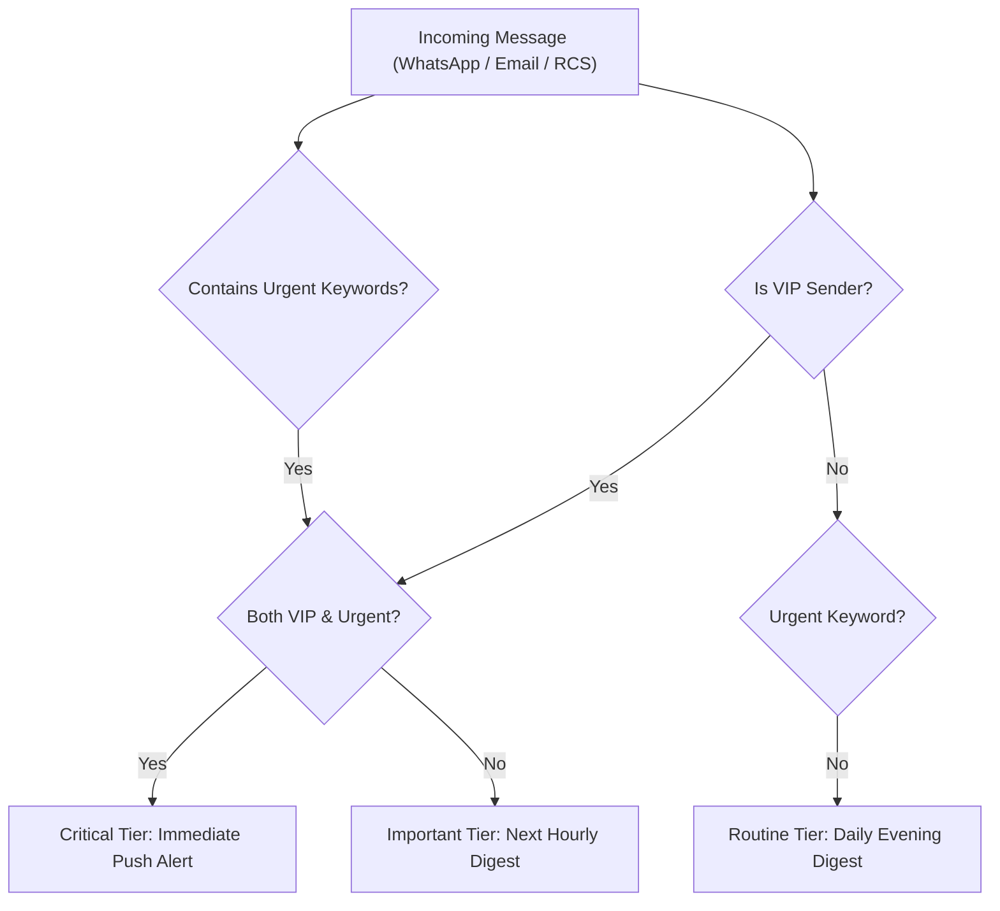

# genpark-inbox-triage-communication-shield-skill

> Cross-Channel Inbox Triage & Communication Shield for Personal AI Agents. 100% Python Standard Library.

Distilled from **Pally**'s inbox-protection methodology, isolating the user from group chat flooding, spam, and non-critical messages across WhatsApp, iMessage, and email.

## Architecture

## Features
- **Fatigue Protection**: Eliminates attention fragmentation from non-urgent group chats.
- **Configurable Routing Paths**: Differentiates between instant interruptions and passive digest summaries.
